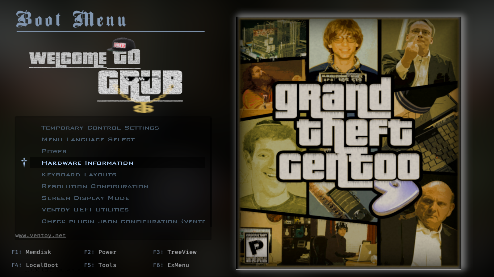

# THIS IS A FORK FROM <https://gitlab.com/imnotpua/grub_gtg>

I customized it to try to make it work on NixOS

## NIX INSTALLATION
In `configuration.nix` set the grub theme like this:

``` nix
boot.loader.grub.theme = pkgs.fetchFromGitHub { # current as of 11/2023
                         owner = "deadendpl";
                         repo = "grub_gtg";
                         rev = "60cabe92eaf3c9404c7d38634fc9018d6e54de82";
                         sha256 = "0h5v1pjx2j5ll4fyz2jxchza32s3624g2klp3ff94kfb6qx6dzfw";
};
```

Then reload your nixos config with `sudo nixos-rebuild switch`.

# Custom Grub Theme

This grub theme was initially designed when I was playing around with grub back in Highschool. Just decided to improvise it and release it to the public.

This grub themes has its look inspired by, [GTA San Andreas Main Menu](./inspiration.png).

## Preview


## Installation

This installer runs on bash, if you don't have bash, do change the env in the `install.sh` file.

This installer also asks for a custom font size for the menu. If the 'grub font maker' is not found a precompiled font of size '24' will be used.

It also prompts for the installation location, where the grub theme is installed. Make sure it is within your boot partition.

## Ventoy

A ventoy version of the theme has been released with a dedicated installer.



## Known Issues

Grub2 currently doesn't support usage of multiple fonts in the menu so I had to hardcode some parts as layers on the background. I would like to find an alternative for it. I have included all the assets required to make the background.
